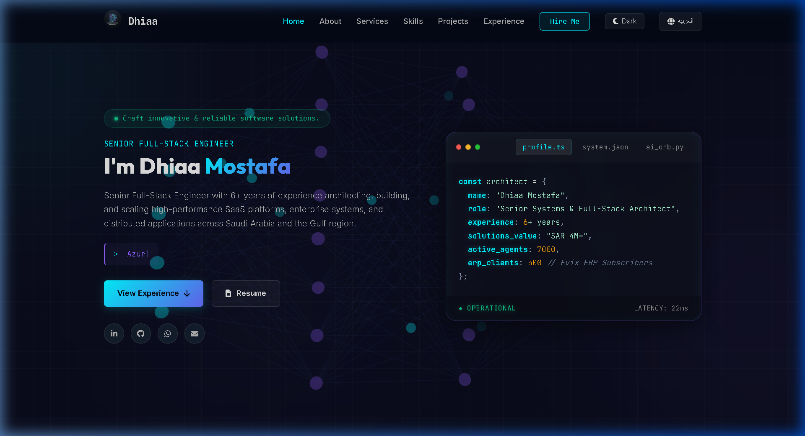

# 🚀 Dhiaa Mostafa - Senior Systems Architect & Full-Stack Engineer Portfolio

<p align="center">
  
</p>

<p align="center">
  <a href="https://dhiaamostafa.com/"></a>
  <a href="https://github.com/dhiaamostafa46"></a>
  <a href="https://linkedin.com/in/dhiaamostafa"></a>
  
</p>

---

## 📌 Overview / نظرة عامة

**English:**  
This repository contains the source code for the personal portfolio website of **Dhiaa Mostafa** — Senior Systems Architect & Senior Full-Stack Engineer with **6+ years of experience** architecting high-performance SaaS multi-tenant platforms, Evix ERP integrations, ZATCA Phase 2 E-Invoicing, high-concurrency WebSockets, and Azure OpenAI LLM workflows across Saudi Arabia & the Gulf region.

**العربية:**  
يحتوي هذا المستودع على الكود المصدري للموقع الشخصي والمحفظة المهنية للمهندس **ضياء مصطفى** — مهندس معماري للنظم وكبير مهندسي البرمجيات (Senior Systems Architect & Senior Full-Stack Engineer) بخبرة تزيد عن 6 سنوات في تصميم وبناء المنظومات السحابية (SaaS Multi-Tenant)، ربط أنظمة ERP (Evix)، الفوترة الإلكترونية ZATCA، المعماريات اللامركزية، وتكامل الذكاء الاصطناعي في المملكة العربية السعودية والخليج.

---

## ✨ Features / المميزات

- 🌌 **3D Neural Architecture Network**: Fullscreen interactive HTML5 canvas rendering node network physics and signal transmissions.
- 💻 **Terminal IDE Showcase**: Interactive mock IDE code editor presenting live architectural specs, system latency, and metrics.
- 🌐 **Bilingual Support (AR / EN)**: Full LTR and RTL multi-language toggle for seamless navigation in Arabic and English.
- 🌙 **Dark Glassmorphism Theme**: Cutting-edge visual aesthetics with vibrant cyan/purple gradients and responsive layouts.
- 📂 **Dynamic Projects Gallery**: Categorized project filter showcasing SaaS Platforms, ERP & Integrations, Real-time WebSockets, and AI Systems.
- ⚡ **SEO & Performance Optimized**: Embedded JSON-LD Schema.org metadata, OpenGraph cards, and fast asset caching.

---

## 🛠️ Built With / التقنيات المستخدمة

- **Frontend Core**: HTML5, Modern CSS3 (CSS Variables, Flexbox/Grid, Glassmorphism)
- **Scripting & Logic**: JavaScript (ES6+), Dynamic Component Rendering
- **Visuals & Effects**: HTML5 3D Canvas API, Typed.js, ScrollReveal.js, Tilt.js
- **Icons & Typography**: Font Awesome 6, Google Fonts (Cairo, Inter, JetBrains Mono, Outfit)
- **Data Stores**: JSON-driven Skill and Stack registries (`skills.json`, `stack.json`, `projects.js`)

---

## 📸 Preview / معاينة موقع المحفظة

| Portfolio Landing Page & Interactive Hero |
| :---: |
|  |

---

## 💻 Local Setup / التشغيل المحلي

To run this portfolio locally:

1. **Clone the repository:**
   ```bash
   git clone https://github.com/dhiaamostafa46/profile.git
   cd profile
   ```

2. **Open in browser:**
   Simply open `index.html` in any web browser or use a local dev server:
   ```bash
   npx serve .
   ```

---

## 📫 Contact & Connect / التواصل

- 🌐 **Website**: [dhiaamostafa.com](https://dhiaamostafa.com/)
- 💼 **LinkedIn**: [linkedin.com/in/dhiaamostafa](https://linkedin.com/in/dhiaamostafa)
- 🐙 **GitHub**: [github.com/dhiaamostafa46](https://github.com/dhiaamostafa46)
- 📧 **Email**: [dhiaamostafa46@gmail.com](mailto:dhiaamostafa46@gmail.com)

---

<p align="center">
  © 2026 <b>Dhiaa Mostafa</b>. Built with precision and passion.
</p>
